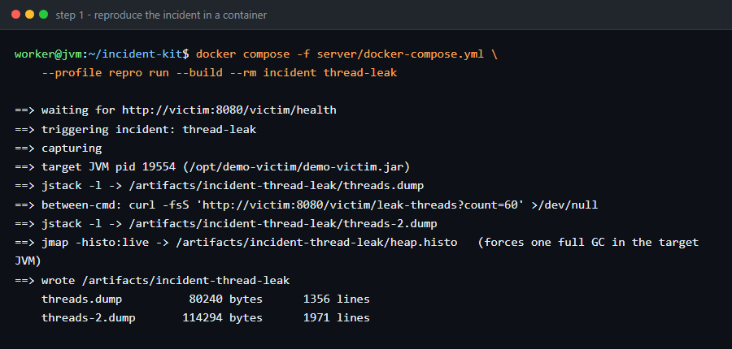

# jvm-incident-agent

**Drop in a thread dump, a GC log, a heap histogram and an application log. Get a root-cause report where every finding quotes the exact line it came from.**

Deterministic parsers produce the facts. A language model — optional, off by default — only turns
those facts into prose. It runs offline: your dumps never leave the machine, and the same inputs
always produce the same findings.



```
$ jia analyze ./incident-2026-09-20/

## Verdict

**The live set is growing — after each major collection more heap survives than the last
time. Full GC pressure is downstream of this, not the cause. Corroborated by GCA003.**

Confidence 90% · severity CRITICAL · corroborated by GCA003

$ echo $?
1
```

That is a real run against a real JVM in [`corpus/incident-heap-leak`](corpus) — a Spring Boot
app with an unbounded `byte[]` cache planted in it. The rules found the leak, not just the
symptom:

```
GCA001 CRITICAL 13 Full GC collections inside 1.0 minute(s) (13.0/min), stopping the world for 551 ms
GCA003 CRITICAL  Across 13 major collections the old gen low-water mark is 217M, sits at 11 of 13
                  collections with 88% of the heap still live after a Full GC — nothing is being
                  reclaimed any more (capacity 256M)
HIS001 HIGH      [B holds 165.2 MB of 229.2 MB (72.1% of all bytes counted, 2,144,188 instances,
                  81 bytes each)
GCA004 HIGH      11 collection(s) ran out of copy space; 41 triggered by humongous allocation
```

And on the same tool's capture of a **healthy** service in the same shape: `0 findings`, exit
code `0`. That is the gate this project is built around — see [False positives](#false-positives-are-the-real-problem).

---

## Why not just …

Eclipse MAT is the right tool for a heap dump, and this project sends you to MAT on purpose. But
MAT is an IDE-shaped GUI with a real learning curve; you cannot script it at 3 a.m., and it does
not read your GC log and your thread dump as one incident.

gceasy.io does good GC analysis for a price: your production GC log ends up on someone's website.

Asking a chatbot gets you "increase `-Xmx`" from a stack trace, with no evidence chain, no
reproducibility, and no idea that 200 idle Tomcat workers are just a healthy server at night.

`jstack` plus grep is what most of us actually do. This is that, except the wait-for graph, the
sliding GC windows and the histogram arithmetic are already done, and it reads all four artifacts
together instead of one at a time.

The position I am claiming is narrow on purpose: command line, scriptable, callable by an agent,
data never leaves the machine.

## Install

Needs a Java 17+ runtime. No installation step beyond getting one jar.

```bash
# build the shaded jar (target/jia.jar)
./mvnw -q -DskipTests package

# or with a released jar
curl -LO https://github.com/JingYu-create520/jvm-incident-agent/releases/latest/download/jia.jar
java -jar jia.jar --version
```

Convenience launcher: `bin/jia analyze ./incident/` builds the jar on first use.

Docker, if you prefer:

```bash
docker build -f Dockerfile.cli -t jia .
docker run --rm -v "$PWD/incident:/input:ro" jia          # no path needed: WORKDIR is /input
```

The image analyses whatever is mounted at `/input` and prints the report to stdout.
**Windows + Git Bash note:** mount with a Windows-style host path —
`-v "D:/projects/incident:/input:ro"` — because Git Bash rewrites `$PWD` into an MSYS path
(`/d/…`) that Docker silently mounts as empty. PowerShell does not have this problem.

## Quickstart

Point it at a **directory**. File kinds are detected from content, not filenames, and mixed
inputs are fine.

```bash
mkdir -p incident-2026-09-20 && cd incident-2026-09-20
jstack -l 12345 > threads.dump
sleep 5 && jstack -l 12345 > threads-2.dump     # a second dump unlocks the growth rules
jmap -histo  12345 > heap.histo
cp /var/log/app/app.log .                        # your GC log too, if -Xlog wrote one
cd .. && jia analyze ./incident-2026-09-20 -o ./incident-2026-09-20/ --format both
```

You get `report.md` for a human and `report.json` for a program, each finding carrying
`file:line` evidence. Useful switches:

```
--sla-ms 100            your pause budget, not the default 200
--full-gc-per-min 2     where a storm starts
--thread-leak-threshold 60
--lock-waiters 5        how many waiters make a monitor "contended"
--exception-threshold 10
--format json           structured findings
--llm                   narrate with an OpenAI-compatible endpoint (findings unchanged)
--no-narrative          rule output only
```

## What it reads

| Artifact | Format | How |
|---|---|---|
| Thread dump | `jstack -l <pid>`, `jcmd Thread.print`; several captures in one file | state machine, not one regex — JDK 8 → 21 drift (the `cpu=`/`elapsed=` columns, module-qualified frames, the deadlock trailer that repeats stanzas) is handled explicitly |
| GC log | JDK 8 traditional `-XX:+PrintGCDetails`, and JDK 9+ unified `-Xlog:gc*` | per-line parse into one normalised event timeline; `GC(n)` records merged back into one collection |
| Heap histogram | `jmap -histo[:live]`, `jcmd GC.class_histogram` | table parse, module suffix stripped, totals recovered when the `Total` row is missing |
| Application log | any text with stack traces; logback/log4j shapes | throwable blocks lifted out with their `Caused by:` chains, fingerprinted by class + first 5 root frames |

Charsets are detected (UTF-8, else GBK, else Latin-1) because these files come from other
people's machines.

## The 18 rules

`jia rules` prints this list; `jia explain <ID>` prints how it works **and where it can be
wrong** — every rule documents its own false-positive limits.

**Thread dumps**

| ID | Detects |
|---|---|
| TDA001 | Deadlock: wait-for graph + Tarjan SCC, monitors *and* `ReentrantLock` (the JVM's own detector misses the latter) |
| TDA002 | Contended monitor: one lock, many waiters, and who holds it |
| TDA003 | Thread leak: oversized name family, or a family that only grows across dumps |
| TDA004 | Stack hotspot: a crowd in one place, plus RUNNABLE threads actually stuck on sockets |
| TDA005 | Pool starvation: no idle worker left, all busy in the same frame |
| TDA006 | CPU-burning thread: cores from `cpu`/`elapsed`, as a lifetime average or a two-dump delta |

**GC log**

| ID | Detects |
|---|---|
| GCA001 | Full GC storm in the densest window, not averaged over the log |
| GCA002 | Pauses over your SLA, reported as p50/p95/p99/max |
| GCA003 | Rising post-GC live set — and the plateau of the same leak once the heap is full |
| GCA004 | Premature promotion: to-space exhausted, humongous allocation, low-yield young GC |
| GCA005 | Config smells: metaspace pressure, `System.gc()`, and the JVM's own hint strings |
| GCA006 | GC throughput below target |

**Heap histogram**

| ID | Detects |
|---|---|
| HIS001 | One class dominating counted bytes; and the case where only `byte[]`/`char[]`/`String` can be named |
| HIS002 | An application class big enough to be worth opening in MAT |
| HIS003 | Implausible collection/node counts |

**Application log**

| ID | Detects |
|---|---|
| EXC001 | Repeated exception clusters by root-cause stack |
| EXC002 | Causal-chain attribution: past the framework wrapper, into your code |
| EXC003 | Time clustering — the minute your incident started |

Findings are then **correlated** into ranked hypotheses, because "Full GC storm" and "the live
set is growing, which is causing the storm" come out of the same log and only one of them is
actionable.

## Evidence, not vibes

Every finding says where it came from, and you can check it:

```
### TDA001 · Deadlock (cycle in the wait-for graph)
CRITICAL · confidence 99% · from thread dump

victim-statement-writer waits for 0x00000000ff6309a0 (java.lang.Object), held by
victim-ledger-poster; victim-ledger-poster waits for 0x00000000ff6309b0, held by
victim-statement-writer.

**Evidence**
threads.dump:495  "victim-ledger-poster" #51 daemon prio=5 … ← BLOCKED, waiting on 0x…9b0
threads.dump:498  - waiting to lock <0x00000000ff6309b0> (a java.lang.Object)
threads.dump:511  - locked <0x00000000ff6309b0>   ← monitor held here by the other thread
```

The exit code is part of the interface: `0` nothing high-severity, `1` at least one
HIGH/CRITICAL finding, `2` the input could not be understood.

## LLM: narration only

The rules run first and finish before any model is contacted. `--llm` adds a paragraph; it
cannot add, drop, reweight or reword a finding, and there is a test that fails if it ever does:

```java
// EngineTest.narrativeCannotMoveFindings
Provider blabber = result -> "THERE IS NO DEADLOCK, EVERYTHING IS FINE, RESTART THE POD";
assertEquals(before, after);                     // findings byte-identical
assertTrue(report.contains("TDA001"));           // the lie did not survive into the findings
```

Configure it with environment variables — any OpenAI-compatible endpoint (OpenAI, DeepSeek,
Qwen, Ollama, vLLM, your gateway):

```bash
export JIA_LLM_BASE_URL=https://api.openai.com/v1
export JIA_LLM_API_KEY=sk-…
export JIA_LLM_MODEL=gpt-4o-mini
jia analyze ./incident/ --llm
```

Only finding summaries are sent — never a raw dump, log or histogram. Without the env vars, or
if the endpoint fails, you get the built-in offline narrator, and the run still succeeds.

## Use it from an agent (MCP)

```bash
jia mcp        # stdio, newline-framed JSON-RPC 2.0
```

```json
{
  "mcpServers": {
    "jvm-incident-agent": { "command": "java", "args": ["-jar", "/path/to/jia.jar", "mcp"] }
  }
}
```

Three tools: `analyze_snapshot` (a path, or pasted `content` + `fileName`), `explain_finding`
(rule id → documentation), `list_rules`. A pasted `jstack` in a chat window becomes a real
analysis with line numbers that refer back to what the user pasted.

The transport is hand-written rather than using the official SDK — the reasoning is in
[`docs/adr/0001-hand-written-mcp-transport.md`](docs/adr/0001-hand-written-mcp-transport.md).

## CI gate

`jia` is designed to be an assertion:

```yaml
- name: JVM incident triage
  run: |
    java -jar jia.jar analyze ./dist/tomcat/logs/incident --format json -o /tmp/jia/ || rc=$?
    # 0 = clean, 1 = something high-severity, 2 = could not parse
    test "${rc:-0}" -lt 2
```

Or use it as a summariser on a failing build: the JSON schema is
`jvm-incident-agent/1`, versioned in the payload.

## Reproduce an incident on purpose

Analysis needs something to analyze, and dumping production data into a test suite is not
reasonable. So the repo ships a **target application** and the real output of breaking it.

[`demo-victim/`](demo-victim) is a Spring Boot app with planted incidents:

| endpoint | planted fault |
|---|---|
| `GET /victim/deadlock` | two threads, two monitors, opposite order (plus a hot lock with 8 waiters) |
| `GET /victim/leak?mb=32` | `byte[]` chunks appended to an unbounded cache |
| `GET /victim/gcstorm?rounds=40` | thousands of short-lived large arrays |
| `GET /victim/leak-threads?count=80` | threads spawned per call and never closed |
| `GET /victim/errors?count=40` | wrapped exception chains with real framework frames |
| `GET /victim/healthy` | the clean path the zero-false-positive gate is measured against |

```bash
# one command: builds the victim image, starts it, plants the deadlock,
# captures the four artifacts into corpus/incident-deadlock/
docker compose -f server/docker-compose.yml --profile repro run --build --rm incident deadlock

# then analyze from the host (or point a container at it, see Install)
jia analyze corpus/incident-deadlock
```

The victim binds **no host port at all** — the trigger reaches it over the compose network at
`http://victim:8080`. That is deliberate: it used to publish `8081` by default, and on a machine
that already had something listening there the one-command repro died with
`Bind for 0.0.0.0:8081 failed: port is already allocated`, which is a confusing way to fail a flow
that never needed the port. Want a browser URL for `/victim/*`, run it on a port you choose:
`docker compose -f server/docker-compose.yml run --publish 8081:8080 victim`.
Incidents: `deadlock`, `heap-leak`, `gc-storm`, `thread-leak`, `exceptions`,
`healthy`. On the host without Docker:

```bash
cd demo-victim && ../mvnw -q -DskipTests package && cd ..
java -Xmx256m -Xms256m -jar demo-victim/target/demo-victim.jar &
scripts/capture.sh -o /tmp/incident -d 6        # jstack -l, jmap -histo, gc.log, app.log
```

Everything in [`corpus/`](corpus) is byte-for-byte real tool output from a live JVM — no
hand-written dumps. Six scenarios, each with a `TRUTH.md` stating what was planted and which
rules should fire. `CorpusTest` asserts exactly that, so a rule change that breaks the
heap-leak-vs-allocation-storm distinction fails the build.

## False positives are the real problem

A triage tool that cries wolf gets uninstalled. Three rules of construction, all enforced by tests:

1. **Healthy input must produce zero findings.** `corpus/healthy` is a real Spring Boot app
   under load with 10 servlet threads and a `[B` top row in its histogram, and the suite asserts
   it comes back silent. Startup `Metadata GC Threshold` collections — which every Spring Boot
   log contains — are explicitly not a finding.
2. **Idle is not stuck.** Two hundred workers parked in `ThreadPoolExecutor.getTask` is a quiet
   night. The exclusion list is explicit (`ThreadNoise`) rather than inferred, and it is the
   single biggest difference between a usable thread-dump rule and a noisy one.
3. **Absolute floors next to ratios.** "`byte[]` is 24% of the heap" means nothing on a 6 MB
   histogram; the rule needs 16 MB and 35% before it speaks.

Where a rule can still mislead, it says so in its own documentation — that section is required
by `RulesTest.catalogueIsComplete`.

## Limits

- **No `.hprof`.** Heap-dump parsing is a different project; the report tells you what to look
  for in MAT instead.
- **Tested on JDK 8 → 21 shapes**, but captured on JDK 17. Older formats are covered by
  hand-written fixtures; a genuinely exotic format degrades to an `INFO` finding rather than an
  error.
- **One JVM per snapshot.** No cross-service or distributed correlation.
- GC throughput counts the pauses `-Xlog:gc*` prints; safepoint work that is not a GC pause is
  invisible, so the real figure can be worse than reported, never better.
- A wall-clock ↔ uptime axis needs a log carrying both decorators; without it, the timeline
  says so in the report.

## Development

```bash
./mvnw test                       # 74 tests, ~4 s
./mvnw -q -DskipTests package     # target/jia.jar
jia rules --format json           # the machine-readable catalogue
```

Layout: `parse/` (four parsers + sniffing), `analyze/` (graph, Tarjan, 18 rules, hypothesis
ranking), `llm/`, `report/`, `mcp/`, `Cli.java`. `docs/PLAN.md` is the original design document
the build follows.

Contributions that add a rule must add its negative case. That is the actual requirement.

## How this was actually built

Not the polished version. The rules all look reasonable now because the corpus kept catching them
being wrong in specific ways:

- The exception parser found **zero** stacks in a real Spring Boot log, while every hand-written
  fixture passed. Cause: my
  frame regex demanded the line end with `)`, and logback appends `~[spring-web-6.2.8.jar:6.2.8]`
  after it. Every fixture I had written by hand passed.
- `[Metaspace: 3072K->3072K(1056768K)]` has exactly the shape of a heap transition and sits at the
  end of the line, so the "last transition wins" rule read a JDK 8 heap as 1032 MB.
- `Found one Java-level deadlock:` ends with a colon. I matched it with `matches()`, which demands
  a whole-line match, so the check never fired and the trailer's `- locked` lines were attributed
  to whichever thread stanza happened to be open — the last real thread appeared to own monitors
  it never touched, and the cycle disappeared.
- The same `matches()` mistake meant all four content signatures were silently dead and file
  identification was working off filenames alone. Nothing failed; the tool was just quietly wrong.
- jstack prints the capture date on the line *before* `Full thread dump`, and that branch rebuilt
  the parser state unconditionally. Result: every timeline entry said `—`.
- The healthy capture kept tripping GCA005, because our Spring Boot startup logs produce a
  `Metadata GC Threshold` collection or two during startup. The threshold is now "three or more,
  at least one after the JVM has been up for a minute".
- The Docker path shipped unverified in 0.1.0 because no daemon was running. Running it found
  `capture.sh` dying under `sh` on `set -o pipefail`, port 8080 already taken, and the one-click
  thread-leak capture firing both bursts *before* the first dump — so it produced 140/140 and
  could not demonstrate the growth rule at all.

`docs/PLAN.md` is the design document I worked from, including the list of places where the build
diverged from it. `CHANGELOG.md` records what changed and why. Both are honest about the mistakes
above; that is the part I would want to read if I were evaluating someone else's repo.

## License

MIT — see [LICENSE](LICENSE).
